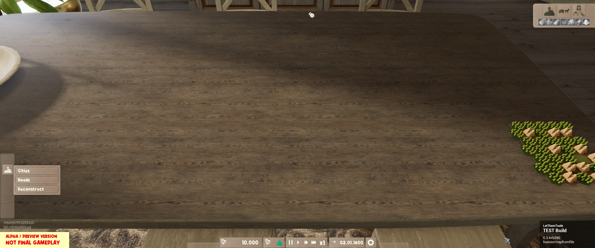
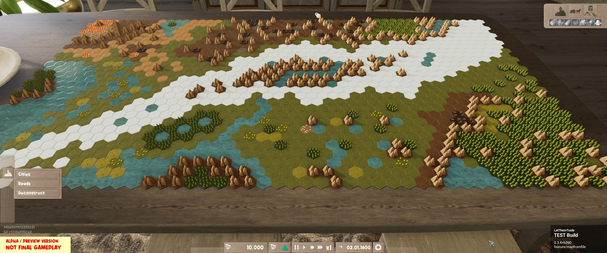

# Community Maps

## Adding your own map

Steps for adding your own map:
1. Fork this project
2. Create a folder for your map in `CommunityMaps`
    1. Directory name must match `"mapName":` in your map.json.
    2. Replace spaces with `_`
       1. see example `Initializing_Errant_Form`
3. Add the .json file to said directory
   1. see example in `Initializing_Errant_Form/e1-m.lttmm.json`
4. Add screenshots of your map to said directory. Best case:
    1. One screenshot of the initial revealed portion of the map
       1. see example in `Initializing_Errant_Form/start.jpg`
    2. One screenshot of the fully revealed map
       1. see example in `Initializing_Errant_Form/revealed.jpg`
5. Add your map to the end of the list below.
6. Check your map, list, screenshots and entry in the list for errors
7. Create a pull request
   1. Not adding your entry to the end of the list will result in me closing your pull request without further comment
   2. Not providing screenshots of your map will result in me closing your pull request without further comment
   3. Not replacing spaces in your directory name with `_` will result in me closing your pull request without further comment
   4. You're welcome to retry your addition to this list after correcting any mistakes

# Maps

| Map Name | Creator | Screenshot start | Screenshot fully revealed |
| :------ | :------ | :------ | :------ |
| [Initializing Errant Form](Initializing_Errant_Form/e1-m.lttmm.json) | Griefed |  | 
| | | | |
| | | | |
| | | | |
| | | | |
| | | | |
| | | | |
| | | | |
| | | | |
| | | | |
| | | | |
| | | | |
| | | | |
| | | | |
| | | | |
| | | | |
| | | | |
| | | | |
| | | | |
| | | | |
| | | | |
| | | | |
| | | | |
| | | | |
| | | | |
| | | | |
| | | | |
| | | | |
| | | | |
| | | | |
| | | | |

